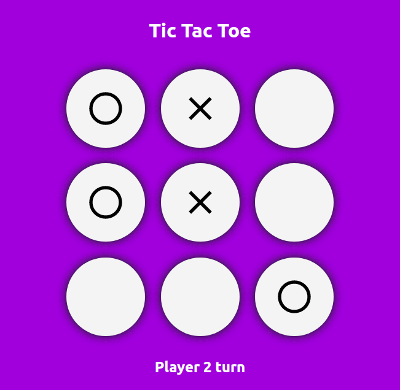
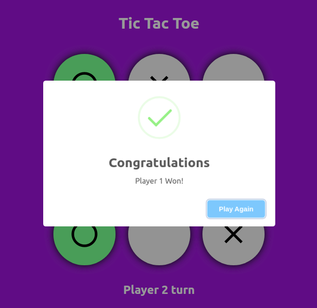
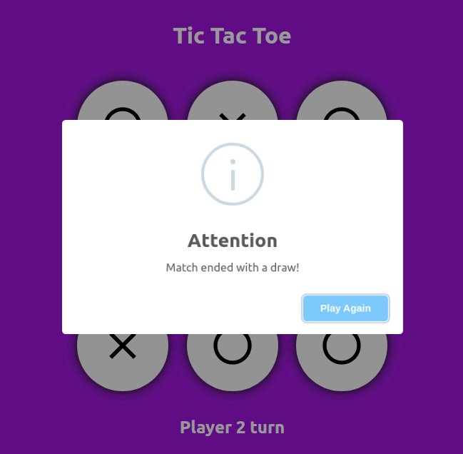

## Tic Tac Toe
Fully responsive two player *tic-tac-toe* game built with react

<br/>

### Live demo
https://accelerator-one.github.io/tic-tac-toe/

<br/>

### Device testing
Following smartphones are tested for breakpoints :
- Moto G4
- Pixel 2 ( XL )
- iPhone 5/SE
- iPhone 6/7/8 ( Plus )
- iPhone X
- iPad ( Pro )
- Surface Duo
- Galaxy Fold

<br/>

### Screenshots
<br/>

  
<br/>

  
<br/>

  
<br/>

<br/>

## Description
- Game is provided with 3 X 3 grid for 2 players.  
- Following are the working aspects of this project :  

    - Player turn will be displayed at the top.
    - For every odd click '**O**' will be assigned and for every even click '**X**' will be assigned on the box.
    - Player cannot mark a box twice.
    
    - A player wins the game when any of the position is satisfied on the board.  
      ( *3 horizontal*, *3 vertical*, *2 cross-sets* )
    - Once the winning condition is satisfied, the winner is notified.
    - Match ends with a draw if all the boxes are filled and no player satisfies the winning criteria.

<br/>

### Prequisites
Make sure you have below development dependencies installed on your CLI environment :
- npm
- node

<br/>

### Deployment
If you want to deploy this project on your hosting provider, follow the steps below :

- Clone the repository
  ```bash
  git clone https://github.com/Accelerator-One/tic-tac-toe.git
  ```

- Install project dependencies
  ```bash
  npm install
  ```

- Running the project locally
  ```bash
  npm start
  ```    

- Apply tweaks if needed and generate the build
  ```bash
  npm run build
  ```

<br/>

### Issues
In case of any problems during implementation, file them under *Issues* section of this repository